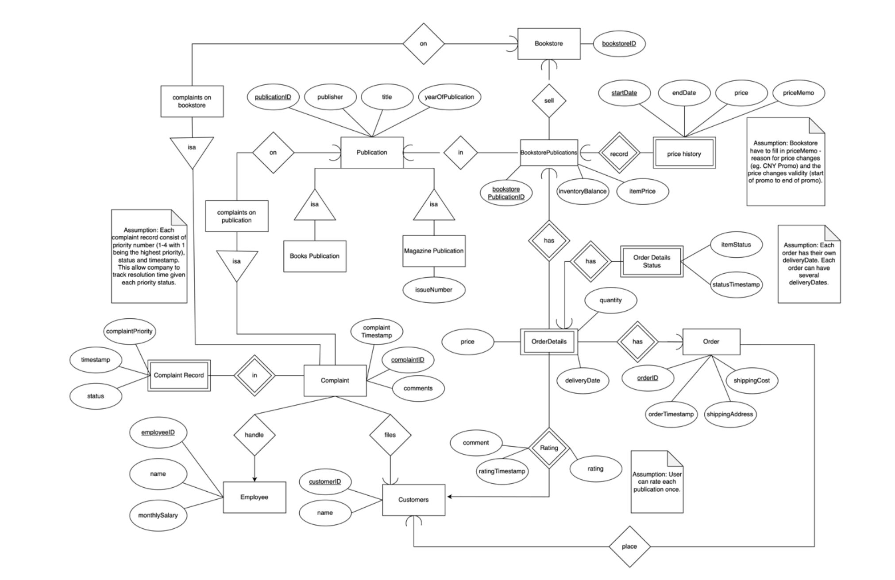

# SC2207-Introduction-to-Database

# About

# Assumptions
<ul>
  <li>We will be using the ER approach. For nested subclasses, we only inherit the keys of the immediate parent.</li>
  <li>When a customer creates a complaint, it is recorded in a complaint table. However, employeeID is added when an employee decided to pick up the case.</li>
  <li>Each OrderDetail contains the aggregation of item price for easier query and instead of querying from PriceHistory from BookstorePublications</li>
  <li>Each complaint record consist of priority number (1-4 with 1 being the highest priority), status and timestamp. This allow company to track resolution time given each priority status.</li>
  <li>Bookstore have to fill in priceMemo - reason for price changes (eg. CNY Promo) and the price changes validity (start of promo to end of promo).</li>
  <li>Each order has its own deliveryDate. Each order can have several deliveryDates.</li>
</ul>  
